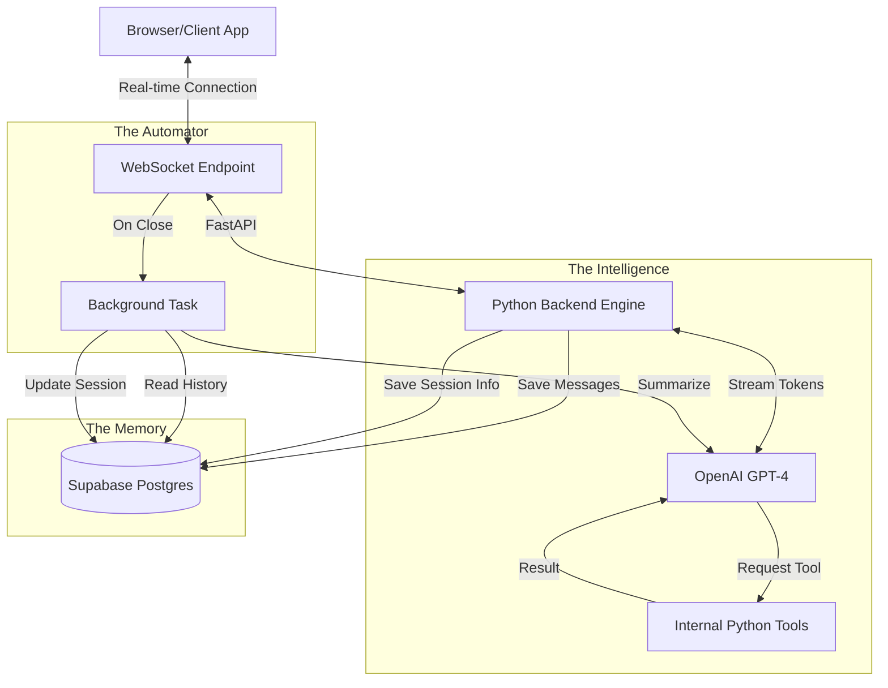

# 01 - Project Blueprint (The Architecture)

Before we write a single line of code, we need to see how the "pipes" are connected. 

## The Visual Map

## Explaining the "Stuffs"

### 1. The Client (The User)
The user is at their computer. They want to talk to our AI. They use a special type of connection called a **WebSocket**. 
- **Normal HTTP**: Like a letter. You send a request, you get a reply. Done.
- **WebSocket**: Like a phone call. The line stays open until someone hangs up.

### 2. FastAPI (The Dispatcher)
FastAPI is our Python web framework. Its job is to listen for the "phone calls" (WebSockets) and route them to the right piece of code. It's incredibly fast because it handles thousands of calls at once using **Async**.

### 3. The LLM (The Brain)
We use OpenAI (or similar). The "Special" part here is **Streaming**. Instead of sending the full answer at once, it sends "chunks" (tokens). 
> Example: Instead of "Hello, how are you?", it sends:
> "H" -> "e" -> "l" -> "l" -> "o" -> "," ...

### 4. Supabase (The Vault)
Supabase is our Database. It's built on **Postgres**. We will have two main drawers in our vault:
- **Sessions**: Info about who called and when.
- **Event Logs**: A transcript of everything that happened.

### 5. Background Tasks (The Cleanup Crew)
In Python/FastAPI, we can run code *after* the user disconnects without making the user wait. This crew reads the transcript, asks the Brain to summarize it, and files it away in the Vault.

## Connections Summary
- **Client ↔ Server**: WebSockets (Bidirectional).
- **Server ↔ LLM**: API call with `stream=True`.
- **Server ↔ Supabase**: SQL / Database Client (Store & Retrieve).

---
**Next Step**: [02 - FastAPI: The Engine](file:///c:/GitRepo/LLM-Backer/docs/02_FastAPI_The_Engine.md)
